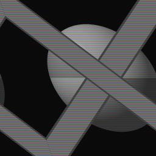
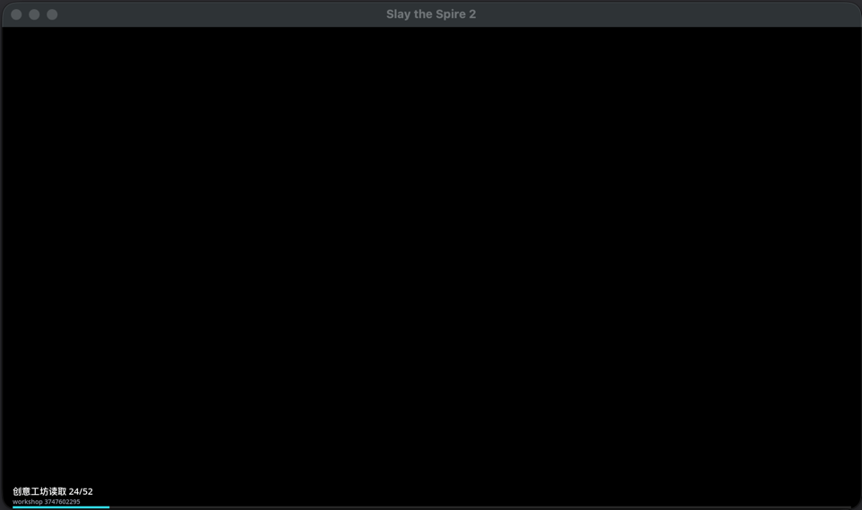

# 不再干等 · It's Loading

> 修复了塔2开 mod 没有进度条的 bug。
>
> Fixes the bug where Slay the Spire 2 shows no loading progress with mods enabled.

## 这是什么

装了一堆 mod 之后,每次启动游戏都要对着黑屏干等十几秒到半分钟,不知道是卡死了还是在加载,只能干瞪眼。

这个 mod 在游戏启动过程中会显示进度条,并且告诉你**现在到底在干什么**:

- 上方细条显示从创意工坊到主菜单的全程阶段进度
- 下方亮条显示当前阶段内部进度
- 正在读取创意工坊订阅(第几个 / 共几个)
- 正在加载哪个模组、花了多少毫秒
- 游戏启动到哪一步(图集 / 本地化 / 模型数据库 / 主菜单资源……)
- 资产批量完成时显示当前正在处理的资源文件

现在打开游戏不用看着黑屏一直傻等着了。

## 主题

在 mod 设置里可以用下拉框选择加载主题(下次启动生效):

- **经典**:底部双条 + 活动日志,低调不打扰
- **Minespire**:整屏红底的居中布局,标签在条上方、活动日志挪到左下角,顶部是像素风游戏 logo,右下角还有一只奔跑的小狐狸——Minecraft 风格的启动画面,加载完成后轻轻淡出揭幕

## 安装

**Steam 创意工坊**: 订阅即用。

**手动安装**:把 mod 文件夹放进游戏目录的 `mods/` 文件夹:

- Windows:`Slay the Spire 2/mods/`
- macOS:右键游戏 → 显示包内容 → `Contents/MacOS/mods/`

首次启动时会完成一次启动画面注入(左上角会有提示),**从下一次启动起**进度条全程可见。

## 卸载

在游戏内 mod 菜单关闭、退订、或直接删掉 mod 文件夹都可以。启动时检测到 mod 已关闭或移除,会自动清理注入的启动画面。

## 兼容性

- 在 Slay the Spire 2  v0.107.1上测试通过
- 和其他 mod 没有加载顺序冲突,不需要当前置

## 已知限制

- 创意工坊读取阶段的计数来自游戏日志,极少数情况下可能略有延迟

---

# It's Loading

> Fixes the bug where Slay the Spire 2 shows no loading progress with mods enabled.

## What is this

With a pile of mods installed, every game launch means staring at a black screen for ages, wondering whether it crashed or is just loading.

This mod shows a progress bar during game startup, telling you **what is actually happening**:

- A thin overall bar tracks the complete path from Workshop discovery to the main menu
- A brighter local bar tracks progress inside the current stage
- Reading Steam Workshop subscriptions (which one / how many)
- Which mod is being loaded, down to the millisecond
- Which boot step the game is on (atlases / localization / model database / menu assets…)
- The current resource file when the game completes assets in batches

No more staring at a black screen while the game boots.

## Themes

Two loading themes, selectable via a dropdown in the mod settings (applies from the next launch):

- **Classic**: the bottom dual-bar strip with the activity log
- **Minespire**: a full-screen red centered layout — labels above each bar, the activity log moved to the bottom-left corner, a pixel-style game logo on top, and a little running fox in the bottom-right — a Minecraft-style boot screen, gently fading out when the boot completes

## Install

**Steam Workshop**: subscribe and play.

**Manual**: drop the mod folder into the game's `mods/` directory:

- Windows: `Slay the Spire 2/mods/`
- macOS: right-click the app → Show Package Contents → `Contents/MacOS/mods/`

The first launch performs a one-time boot-splash injection (you'll see a notice). The progress bar covers the full startup **from the next launch on**.

## Uninstall

Turn it off in the in-game mod menu, unsubscribe, or delete the mod folder — whichever. On the next launch the mod detects it's gone and removes the injected boot splash automatically.

## Compatibility

- Tested on Slay the Spire 2 v0.107.1
- No load-order requirements, no conflicts with other mods

## Known Limitations

- Workshop reading counts come from the game log and may occasionally lag a little

---

## 鸣谢 / Credits

- Minespire 主题的奔跑狐狸动画来自 [NeoForged/FancyModLoader](https://github.com/neoforged/FancyModLoader),采用 LGPL-2.1 授权,感谢 NeoForged 与贡献者们;主题 logo 为 AI 生成图像。详见 [LICENSE_CLAIM.md](LICENSE_CLAIM.md)
- The running fox animation in the Minespire theme is from [NeoForged/FancyModLoader](https://github.com/neoforged/FancyModLoader) (LGPL-2.1). Thanks to NeoForged and its contributors; the theme logo is an AI-generated image. See [LICENSE_CLAIM.md](LICENSE_CLAIM.md)

---

*非官方社区 mod,与 MegaCrit 无关 · An unofficial community mod, not affiliated with MegaCrit.*
